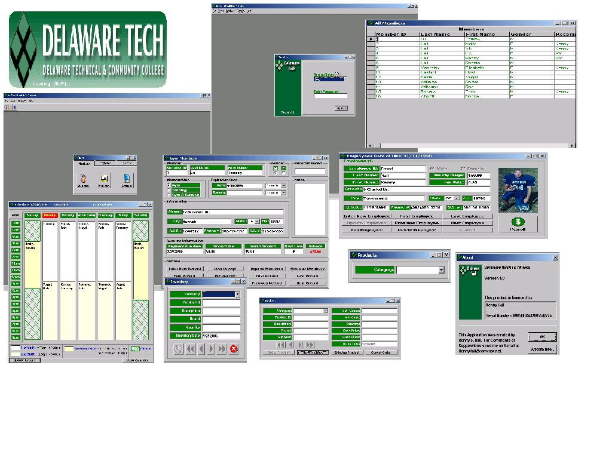



## \[ \! Gym Application \! \]

### Description

This is a gym application that I created for my VB class. This App. keeps track of members, employees and inventory. This program uses MS Access with SQL DAO.
 
### More Info
 
No side Effects.

             |
---                |---
**Submitted On**   |2005-01-31 10:27:14
**By**             |[Kenny S Hall](https://github.com/Planet-Source-Code/PSCIndex/blob/master/ByAuthor/kenny-s-hall.md)
**Level**          |Intermediate
**User Rating**    |4.6 (233 globes from 51 users)
**Compatibility**  |VB 6\.0
**Category**       |[Databases/ Data Access/ DAO/ ADO](https://github.com/Planet-Source-Code/PSCIndex/blob/master/ByCategory/databases-data-access-dao-ado__1-6.md)
**World**          |[Visual Basic](https://github.com/Planet-Source-Code/PSCIndex/blob/master/ByWorld/visual-basic.md)
**Archive File**   |[Gym\_Applic1846011312005\.zip](https://github.com/Planet-Source-Code/kenny-s-hall-gym-application__1-58574/archive/master.zip)

